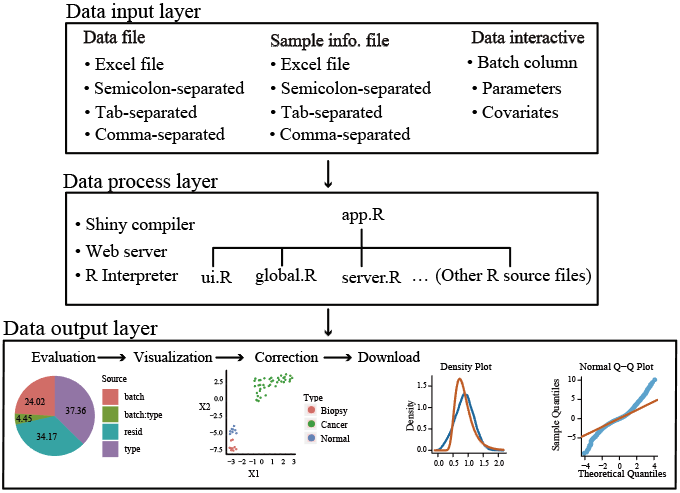

#### 

	
####  BatchSerer is a web server for batch effect evaluation, visualization and correction. 
####  It's mainly based on following R packages, which are further wrapped by [`R/Shiny`]('http://shiny.rstudio.com/').
> + `pvca`:  For batch effects evaluation
> + `umap`, `ggplot2`, `plotly`:  For batch effects visualization
> + `sva`:  For batch effects correction (improved version)
> + `fitdistrplus`, `extraDistr`:  For goodness-of-fit test

####  The batchSever is composed of the following three layers: 

